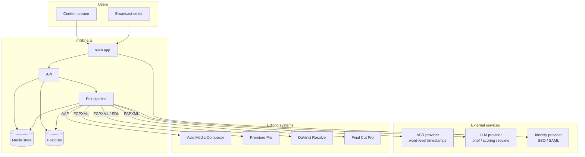
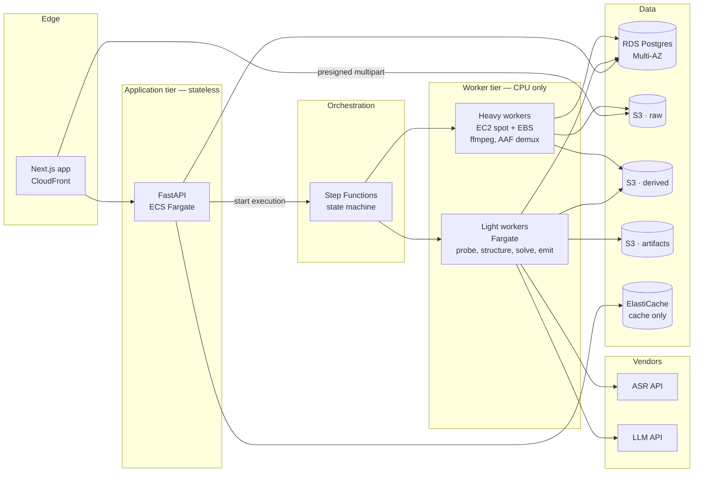
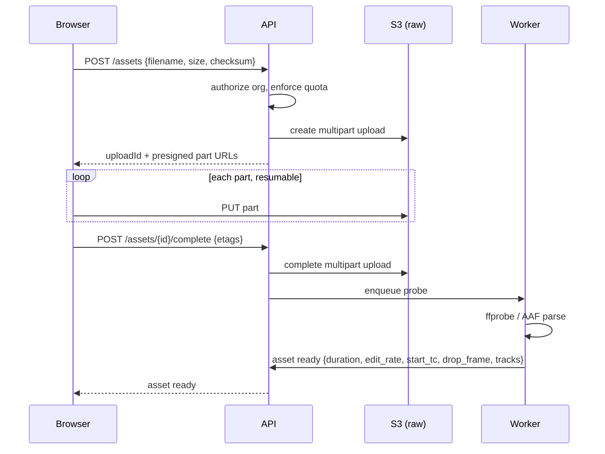
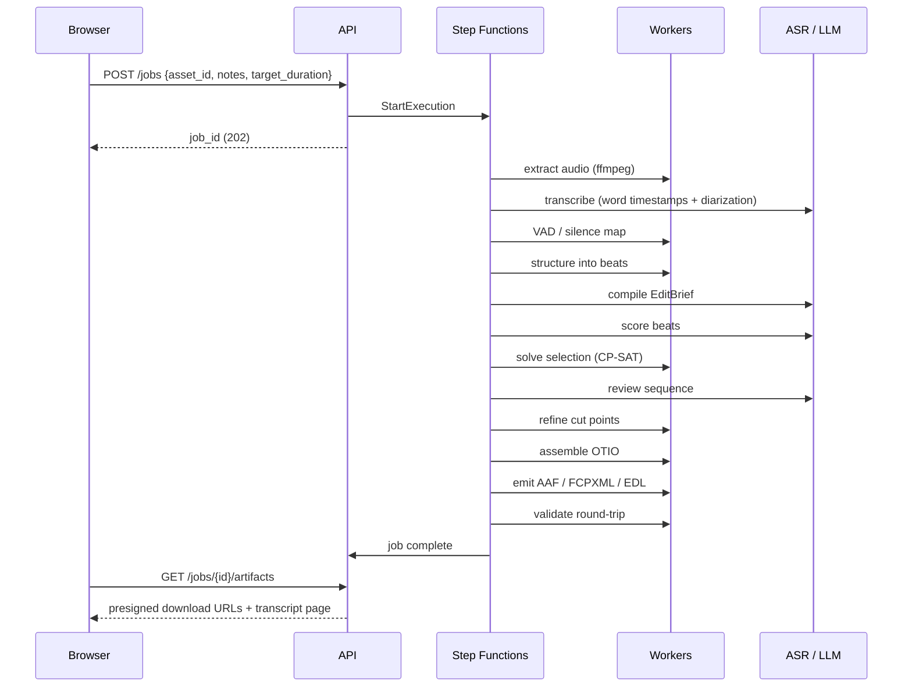

# 00 — System Overview

## The shape of the problem

mishne.ai is **a deterministic media pipeline with LLM judgment injected at three
well-defined points.** It is not an agent, and the distinction drives every other
decision in this document.

A job is a known DAG: probe → extract audio → transcribe → structure → score →
select → refine cut points → assemble → emit artifacts. It runs unattended for
10–60 minutes, must be retriable, must be billable at a predictable cost, and must
be able to answer "why was this cut chosen?" six months later. Those requirements
point at a workflow engine, not an agent loop. See
[ADR-0002](../adr/0002-workflow-engine-not-agent-framework.md).

The three places where genuine judgment is required:

1. **Brief compilation** — free-text director's notes → a structured `EditBrief`.
2. **Beat scoring** — each transcript segment scored for value against the brief.
3. **Sequence review** — does the assembled selection read as a coherent piece?

Everything else — voice activity detection, cut-point snapping, duration solving,
timecode arithmetic, AAF generation — is deterministic code. That is what makes the
system debuggable, reproducible, and cheap.

## Design principles

**1. Text is the edit surface; audio is the quality surface; video is untouched.**
The LLM reasons over transcript. Cut *placement* still needs the audio waveform —
silence boundaries, breaths, loudness — because a cut that lands mid-breath sounds
wrong no matter how good the word choice was. Video is never decoded beyond probing
metadata. This is the cost and latency win.

**2. One canonical timeline representation.** Every job converges on a single
OpenTimelineIO document. Every output format is a projection of it. No format
converts directly to another. See [ADR-0001](../adr/0001-otio-as-canonical-timeline.md).

**3. Every step is a pure, idempotent function of `(job_id, step_input) → artifact`.**
Inputs and outputs live in object storage, referenced by key. A step can be replayed
without replaying the pipeline. This is what makes the orchestrator swappable and the
system debuggable, and it costs nothing to adopt on day one.

**4. Reproducibility is a product feature, not an engineering nicety.** Model
versions, prompt versions, brief JSON, scores, and rationale are all persisted per
job. When a broadcaster asks why their best soundbite was dropped, there is an
answer. This also happens to be the trust-building mechanism with professional
editors, who start from a position of scepticism.

**5. Never hold customer footage longer than the job needs.** Pre-air and embargoed
material is the most sensitive asset a broadcaster has. Retention is short by
default and configurable. See [04 — Security](04-security.md).

**6. Multi-tenancy is enforced at the data layer, not the application layer.**
`org_id` on every row, Postgres RLS as the backstop.

## System context

## Component map

Note what is **not** in this diagram: no GPU fleet, no Kubernetes, no message broker
of record, no microservices. The worker split is by resource profile (does this step
need 200 GB of scratch disk?) rather than by domain, which keeps deployment simple
while still letting the expensive tier scale independently.

## The two request flows

### Upload

Media never transits the API. The browser talks to S3 directly with short-lived
presigned URLs. This matters more than it might appear: a 3-hour ProRes 422 master
is roughly 200 GB, and proxying that through an application tier is both an enormous
bandwidth bill and a guaranteed source of timeouts.

### Job

Progress is streamed to the browser over SSE from the API, which reads step status
from Postgres. The frontend never talks to the orchestrator.

## Technology choices, and why

| Layer | Choice | Reasoning |
|---|---|---|
| Frontend | Next.js (App Router) | Server components for auth-gated pages, native SSE for job progress, mature upload ecosystem |
| Upload | Uppy + S3 multipart | Resumable by default. Non-negotiable for multi-GB files on unreliable connections |
| API | FastAPI (Python) | The entire media toolchain — pyaaf2, OpenTimelineIO, ffmpeg bindings — is Python. Splitting languages for an MVP buys nothing and costs a serialization boundary through the hottest part of the system |
| Orchestration | AWS Step Functions | Durable execution, declarative retries, per-execution history, nothing to operate. See [ADR-0002](../adr/0002-workflow-engine-not-agent-framework.md) |
| Compute | ECS Fargate + EC2 spot | Two profiles: light steps on Fargate, disk- and CPU-heavy ffmpeg/AAF steps on EC2 with EBS. Fargate ephemeral storage caps at 200 GB, which a large AAF will exceed |
| Database | RDS Postgres | Relational data with strict tenancy needs. RLS gives a real isolation backstop. pgvector for beat-redundancy clustering without a second datastore |
| Object storage | S3, three buckets | Separate raw / derived / artifacts for independent lifecycle rules, KMS keys, and access policies |
| Auth | WorkOS | Broadcast buyers ask for SAML SSO in the first procurement conversation. Building this is weeks of work with a long tail of edge cases |
| ASR | Provider interface, managed backend | See [ADR-0003](../adr/0003-managed-asr-behind-an-interface.md) |
| LLM | Claude, behind an interface | Already in use internally; strong structured-output support; enterprise zero-retention terms available |

## What is deliberately deferred

Named here so they don't get built by accident:

- Kubernetes. ECS is sufficient until there is a platform team.
- Microservices. One API, one worker image, two task definitions.
- Multi-region. Single region until a customer contractually requires otherwise.
- Self-hosted ASR. Interface makes it a swap; see [ADR-0003](../adr/0003-managed-asr-behind-an-interface.md).
- Real-time collaboration on the transcript page.
- Any model fine-tuning.
- Video proxy generation — only needed once there is an in-browser review player,
  and the MVP deliverable is a downloadable timeline, not a preview.
