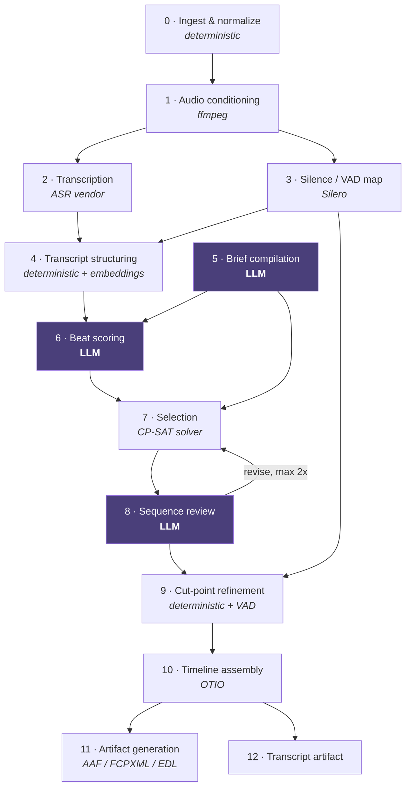

# 01 — The Edit Engine

This is the product. Everything else is plumbing around it.

The engine turns a transcript plus a director's note into an ordered list of source
timecode ranges. Twelve stages, three of which call an LLM.



---

## Stage 0 — Ingest & normalize

Establish the time base before anything else. Every timing bug downstream traces
back to getting this wrong.

Record and freeze for the job:

- `edit_rate` as a rational — `24000/1001`, not `23.976`
- `start_timecode` from the source TC track
- `drop_frame` flag
- `audio_sample_rate` per track

All internal time is `opentimelineio.opentime.RationalTime`. Floating-point seconds
appear only at vendor API boundaries and are converted immediately on the way in.
A 3-hour timeline at 29.97 DF accumulates visible drift within minutes if times are
carried as floats.

**Flat video file:** probe with `ffprobe`, synthesize a source mob ID, record
filename and reel/tape name for relink.

**AAF input:** parse with `pyaaf2` into OTIO. Extract per-clip source references,
existing mob IDs, tape names, and source TC ranges. Inheriting the source's mob IDs
is what makes the output AAF relink cleanly in the editor's project — the single
biggest advantage of AAF-in / AAF-out over flat-file input.

## Stage 1 — Audio conditioning

```
ffmpeg -i <source> -vn -ac 1 -ar 16000 -c:a pcm_s16le <out>.wav
```

**Per source clip, never on a flattened mix.** For multicam or multi-track
sequences, knowing which microphone a word came from is what allows the engine to
choose the best-recorded take of the same line, and to keep A-roll on the right
source.

Also run `ebur128` loudness analysis per track. Used later to flag unusable audio
and to break ties between near-identical takes.

## Stage 2 — Transcription

Requirements on the ASR provider, in priority order:

1. **Word-level timestamps.** Segment-level is useless — cuts land between words.
2. **Timestamp alignment accuracy.** More important than word error rate. A provider
   with 3% WER and sloppy word boundaries produces worse cuts than one with 5% WER
   and tight ones. Benchmark on boundary precision, not just WER.
3. **Speaker diarization.**
4. **Disfluencies preserved.** Most APIs default to "smart formatting" that silently
   drops filler words and normalizes false starts. **Turn this off.** Removing "um"
   is mishne.ai's job, and it cannot do it without knowing where they are.
5. Per-word confidence — feeds take selection and flags passages needing review.

Persist the raw vendor response verbatim to object storage. Reprocessing a job
should never mean paying for transcription twice.

Map ASR time to source timecode immediately on receipt and store both. Every
downstream artifact references source TC.

## Stage 3 — Silence / VAD map

Silero VAD over each audio track. CPU, fast, tiny model.

Produces speech and silence intervals, and by extension breath positions. This is
the bridge between the text-level decisions and cuts that sound natural. Stage 9
cannot work without it.

## Stage 4 — Transcript structuring

Deterministic first, LLM never. This stage is cheap and mechanical, and doing it
before scoring means the LLM sees clean structured beats rather than a wall of
words.

**Words → sentences.** Punctuation plus pause length. A pause over ~600 ms is a
sentence boundary regardless of what the ASR punctuation says.

**Sentences → beats.** Split on speaker change, long pause, or topic shift. A beat
is the smallest unit that can stand alone in a cut — typically one to four sentences.

**Flag, don't delete:**

| Flag | Detection |
|---|---|
| `filler` | Per-language lexicon — um, uh, you know, כאילו, אה |
| `false_start` | Repeated n-gram prefix within a short window |
| `retake` | High embedding similarity between nearby beats — the subject said it again, better |
| `crosstalk` | Overlapping diarization spans |
| `low_confidence` | Mean word confidence below threshold |
| `off_mic` | Loudness well below the track's speech median |

Retake detection deserves emphasis: in raw interview and presenter material, the
same line is frequently delivered three or four times. Automatically preferring the
last clean take is one of the highest-value things the engine does, and it is
entirely deterministic — embedding similarity plus confidence plus loudness.

Output: `Beat[]`, each with text, time range, speaker, source clip, and flags.

## Stage 5 — Brief compilation *(LLM)*

Free-text director's notes → strict JSON, via structured output.

```json
{
  "target_duration_s": 600,
  "duration_tolerance_s": 30,
  "tone": ["urgent", "conversational"],
  "narrative_shape": "inverted_pyramid",
  "must_include": ["the funding announcement", "the CEO's apology"],
  "must_exclude": ["anything about the lawsuit"],
  "speaker_priority": ["Speaker 1", "Speaker 3"],
  "pacing": "tight",
  "keep_filler": false,
  "handle_frames": 6,
  "language": "en",
  "clarifications": [
    "Notes say 'punchy' but no target duration was given; assumed 10 minutes."
  ]
}
```

`narrative_shape` is one of `chronological`, `thematic`, `inverted_pyramid`,
`q_and_a`.

Real director's notes are frequently underspecified — "make it punchy, about ten
minutes." The brief compiler must apply documented defaults and surface every
assumption in `clarifications`, which the UI shows before the job runs. In practice
a guided form alongside the free-text box will produce better results than free text
alone; treat the free text as the escape hatch, not the primary input.

## Stage 6 — Beat scoring *(LLM)*

A 3-hour transcript is roughly 30–40k words, comfortably inside a modern context
window. Chunk it anyway — with overlap — for parallelism, cost control, and scoring
consistency.

Per beat:

| Field | Meaning |
|---|---|
| `informational_value` | How much does this advance understanding? |
| `narrative_value` | Does it move the story? |
| `quotability` | Would this be pulled as a soundbite? |
| `emotional_weight` | Register and intensity |
| `brief_alignment` | Fit against the compiled `EditBrief` |
| `standalone_comprehensibility` | Does it make sense cold, without setup? |
| `topics[]`, `entities[]` | For clustering and redundancy detection |
| `depends_on[]` | Beats that must be included for this one to make sense |
| `rationale` | One line, persisted, surfaced in the transcript artifact |

`depends_on` is the field most often missed and the one that most affects perceived
quality. A payoff without its setup reads as a non-sequitur, and no amount of good
scoring on the payoff itself will fix it.

**Redundancy:** embed every beat, cluster with pgvector. Near-duplicates form a
cluster, and the solver picks at most one member. This is what stops the same point
appearing three times in a ten-minute cut.

## Stage 7 — Selection *(deterministic solver)*

**This is the stage most implementations wrongly hand to the LLM.** Language models
cannot reliably hit a duration target — ask for exactly ten minutes and you get
seven or fourteen. This is a constrained optimization problem and belongs in a
solver. See [ADR-0004](../adr/0004-constraint-solver-for-selection.md).

Maximize total weighted beat value, subject to:

- total duration within `target ± tolerance` — **hard constraint**
- `must_include` beats forced in
- `must_exclude` topics forced out
- dependency closure: selecting a beat selects its `depends_on`
- at most one beat per redundancy cluster
- minimum segment duration (default 1.0 s) — no machine-gun micro-cuts
- speaker balance bounds where `speaker_priority` is set
- flagged `false_start` and `off_mic` beats excluded unless nothing else qualifies

OR-Tools CP-SAT. The problem is small — a few hundred beats — so it solves optimally
in well under a second. Same input plus same scores yields the same cut, every time.

Order the selection according to `narrative_shape`.

## Stage 8 — Sequence review *(LLM)*

Present the selected, ordered beats as a continuous script. Ask:

- Does it read coherently start to finish?
- Any orphaned pronouns or references to material that was cut?
- Any abrupt topic jumps needing a bridging beat?
- Does the opening earn attention and the ending land?

Returns targeted operations — swap, remove, add-from-runner-up — rather than a
rewritten selection. Feed those back as additional solver constraints and re-solve.

**Bounded at two iterations.** Predictable latency, predictable cost. An unbounded
refinement loop is exactly the failure mode that makes agentic pipelines unshippable.

## Stage 9 — Cut-point refinement *(deterministic)*

Where text-level decisions meet the waveform. For every selected beat:

1. **Snap outward to the nearest silence boundary** from the VAD map. Never inward —
   clipping the last consonant of a word is the most audible possible failure.
2. **Add handles.** Default 6 frames each side, configurable. A rough cut without
   handles is unusable; the editor has nothing to trim with. Non-negotiable.
3. **Assert no cut falls inside a word span.** Hard failure if violated.
4. **Quantize to frame boundaries** in the sequence edit rate. Keep audio
   sample-accurate where the output format supports it.
5. **Merge adjacent selections** separated by less than ~400 ms into a single clip.
6. **Enforce minimum duration** after all snapping and merging.

## Stage 10 — Timeline assembly

Build an OTIO `Timeline`: one video track, N audio tracks, clips referencing the
original source media with correct source TC ranges and, where available, inherited
mob IDs.

**This OTIO document is the canonical output.** Persist it. Every downstream format
is a projection of it, and it is what a support engineer will ask for when a
customer reports a bad export.

## Stage 11 — Artifact generation

See [02 — Media & Interchange](02-media-and-interchange.md) for format specifics and
the relink problem.

**Every generated file is re-parsed and diffed against the source OTIO before the
job is marked complete.** Clip count, in/out points, track assignment, total
duration. If the round-trip does not match, fail the job rather than deliver a
broken file. This gate is a few hours of work and will prevent a large share of
future support load.

## Stage 12 — Transcript artifact

Full transcript with used and unused material marked, per-segment rationale, source
timecode links, speaker labels, and the compiled brief including its clarifications.

This is the explainability layer, and it is a genuine differentiator. Professional
editors do not trust automated selection by default. Being able to see *why* a
soundbite was chosen — and what was considered and rejected — converts scepticism
into use faster than any accuracy improvement will.

---

## Reproducibility contract

Persisted per job: prompt template versions, model identifiers, ASR provider and
model version, the compiled brief, every beat score with rationale, solver inputs and
the chosen solution, and the canonical OTIO.

Given the same asset and the same brief, a job should be reproducible to the frame.
The LLM stages introduce variance; pinning model versions and using low temperature
for scoring bounds it. Where exact reproducibility is contractually required, cache
scores by `(beat_hash, brief_hash, prompt_version, model_version)` and replay.

## Where an agent *does* belong

Not here. But v2's "talk to your rough cut" — *make it two minutes shorter, keep the
part about the merger, lose the second speaker* — is genuinely open-ended, is
interactive with a human in the loop, and has a bounded blast radius because it
operates on an existing selection. That is a legitimate agentic surface, and it can
sit on top of this pipeline by re-running Stage 7 with modified constraints.
