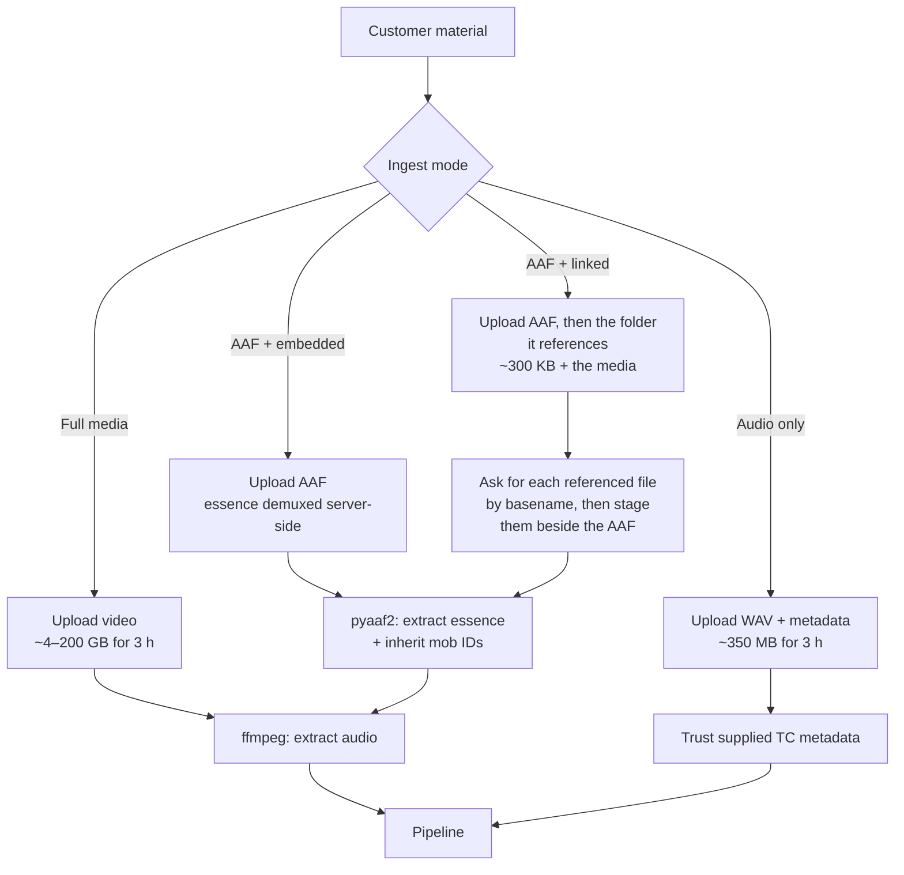

# 02 — Media & Interchange

The AI part of mishne.ai is the part most likely to work. **This is the part most
likely to fail.** Generating an AAF that Avid Media Composer opens, relinks, and
plays at the correct timecode is the highest technical risk in the project, and it
has nothing to do with machine learning.

## The relink problem

mishne.ai delivers an edit decision, not media. The output timeline references the
editor's own source files. For that to work, the editor's NLE must be able to match
the references in the file to the media already in their project or on their storage.

Matching happens on some combination of:

| Key | Formats | Reliability |
|---|---|---|
| Source Mob ID (UMID) | AAF | Highest — exact, when inherited from the source AAF |
| Tape / reel name + source TC | AAF, EDL | High, and the traditional broadcast path |
| File path | FCPXML | Fragile — breaks the moment media moves |
| Filename | All, as fallback | Works, with manual relink |

**This is the strongest argument for AAF-in / AAF-out.** When the input is an AAF
exported from the customer's own project, the source mob IDs come along with it. The
output AAF carries the same IDs and relinks silently. When the input is a flat video
file, mob IDs must be synthesized, and the editor relinks by filename or tape name —
which works, but involves a dialog and an opportunity for the customer to conclude
the product is broken.

Both paths must be supported. The flat-file path needs a good relink guide in the UI.

## Ingest modes

### On the linked-AAF path

**This is what Media Composer exports by default** — the reason the mode exists
rather than being a convenience. A linked AAF is a few hundred kilobytes of
pointers at media on the editor's SAN, next to a folder the exporter calls
`AAF Media`. Refusing it is a checkbox in somebody else's application,
discovered after they have already uploaded, and the embedded alternative can be
tens of gigabytes larger than the media they already have on disk.

The locators inside are absolute paths into a filesystem we will never see —
`file:///D%3a/Pepper/Law_Podcast/Export/ForMishne/AAF%20Media/…` in the real
sample, drive letter and percent-encoding and all. **Resolution is on basename,
normalised for case**, which is the whole of it: the AAF is probed on arrival,
one row per referenced file it does not contain goes into
`asset_media_requirements`, the customer uploads those files, and the worker
materialises them beside the AAF under their own names so the parser's existing
same-directory fallback finds them unchanged. ADR-0014.

**Treat it as untrusted input on the same terms as the embedded case** — the
section below applies, and adds one of its own: a folder is many objects, each
under `max_upload_bytes`, whose *sum* is what a worker has to hold. See the
amended sizing note in ADR-0013.

**A sequence's sound tracks are mixed for transcription** and the per-track
renders are kept for speaker attribution (ADR-0019). A four-microphone podcast
is four sound tracks and four referenced files, and all four are asked for.

### On the audio-only path

For a three-hour job the engine needs perhaps 350 MB of 16 kHz mono audio. A
ProRes 422 master of the same material is around 200 GB — a factor of roughly 500.
Over a 100 Mbit/s connection that is the difference between a five-minute upload and
a four-and-a-half-hour one.

Since the output references source media by timecode and never contains pixels,
**the customer often does not need to upload video at all.** They export a mixdown
and supply the source TC, or the desktop helper does it locally.

This is worth treating as a first-class path rather than an optimization. It changes
upload from the worst part of the experience to a non-event, cuts storage cost by
orders of magnitude, and — most significantly for a broadcast buyer — means mishne.ai
never holds their footage. See [ADR-0005](../adr/0005-audio-only-ingest-path.md).

The tradeoff is real and must be stated plainly: with audio only, the TC alignment
cannot be independently verified, and the relink burden shifts to the customer.
Offer both; default creators to full media and professionals to audio-only.

Codec matters enormously to which mode makes sense:

| Source | Approx. size, 3 h | Upload at 100 Mbit/s |
|---|---|---|
| H.264 camera original, 25 Mbit/s | ~34 GB | ~45 min |
| DNxHD 145 | ~190 GB | ~4.5 h |
| ProRes 422, 1080p | ~200 GB | ~4.5 h |
| ProRes 422 HQ | ~300 GB | ~6.5 h |
| **16 kHz mono WAV** | **~0.35 GB** | **~30 s** |

## Timecode

The most common source of silent, hard-to-diagnose bugs in this class of system.

**Rules:**

- All internal time is `RationalTime`. Never floats, never strings, except at
  vendor boundaries.
- Frame rate is a rational: `24000/1001`, not `23.976`.
- Drop-frame is a *display* convention. Store frame counts; format on the way out.
  Never do arithmetic on drop-frame strings.
- Audio and video have different natural units. Convert at the boundary, once.
- Source timecode and sequence timecode are distinct. Every clip carries both.
- Mixed-rate sources in one AAF sequence: conform to the sequence rate, and record
  the conversion so it can be explained later.

Write property-based tests for the timecode layer before writing anything else. It
is a small amount of code that everything depends on, and errors surface as
"the audio drifts about a second by the end" — three steps removed from the cause.

## Output formats

| Format | Writer | Targets | Notes |
|---|---|---|---|
| AAF | `pyaaf2`, or OTIO AAF adapter | Avid Media Composer | Highest risk, highest value |
| FCPXML | OTIO adapter | Premiere, Resolve, Final Cut | Broadest reach, most forgiving |
| CMX3600 EDL | `otio-cmx3600-adapter` | Everything | Lowest fidelity, universal fallback |
| OTIO | Native | Internal canonical | Always persisted |
| `mishne.json` | Own schema | Transcript page, API | Rationale, scores, unused material |

### What the spike found

`spikes/aaf-roundtrip/` has since tested this. The short version, with detail in
its [README](../../spikes/aaf-roundtrip/README.md):

- **AAF was the reliable one.** It writes and round-trips frame-exact at all four
  rates — but only when every clip carries an explicit `metadata["AAF"]["MobID"]`.
  Without it the writer refuses outright. The `use_empty_mob_ids` escape hatch
  writes a file that no editor can relink, because the MobID *is* the relink key.
- **FCPXML was the fragile one.** Its adapter cannot write 23.976 or 29.97
  without a patch, and reads them back roughly 4% wrong.
- **EDL carries no frame rate at all**, so it is ambiguous unless the rate is
  communicated some other way.
- Validating by round-tripping through the same library is a weak check —
  a symmetric bug agrees with itself. Parse independently.

### On the AAF writer

The OpenTimelineIO AAF adapter has a documented history of producing files that
Media Composer refuses or hangs on — see OTIO issues
[#1701](https://github.com/AcademySoftwareFoundation/OpenTimelineIO/issues/1701)
(AAF export from `otioconvert` hanging Media Composer),
[#535](https://github.com/AcademySoftwareFoundation/OpenTimelineIO/issues/535)
(NoneType media reference on export), and
[#827](https://github.com/PixarAnimationStudios/OpenTimelineIO/issues/827)
(group clips). `pyaaf2` has similar reports, including
[#132](https://github.com/markreidvfx/pyaaf2/issues/132) — a minimal AAF with an
embedded WAV that Media Composer would not open.

None of these are reasons to avoid the libraries; they are the best available and
`pyaaf2` underpins the OTIO adapter. They are the reason to **treat AAF export as a
spike to be resolved in week one, before any product work.** The fallback, if the
generic writers do not produce acceptable files, is to write AAF with `pyaaf2`
directly, structured against a known-good reference AAF exported from Media Composer
itself. Byte-comparing generated output against a real Avid export is the fastest way
to find what is missing. Budget for this path rather than discovering it in month three.

### Per-NLE acceptance criteria

Since all four NLEs are day-one targets, define what "works" means concretely and
build it into CI as a manual-verification checklist per release:

| Check | Avid | Premiere | Resolve | FCP |
|---|---|---|---|---|
| File opens without error | AAF | FCPXML | FCPXML | FCPXML |
| Media relinks | Mob ID | Path/name | Path/name | Path/name |
| Cut count matches OTIO | ✓ | ✓ | ✓ | ✓ |
| First and last frame TC exact | ✓ | ✓ | ✓ | ✓ |
| Audio in sync at 3 h | ✓ | ✓ | ✓ | ✓ |
| Handles present and trimmable | ✓ | ✓ | ✓ | ✓ |
| Multi-track audio preserved | ✓ | ✓ | ✓ | ✓ |

Test at 23.976, 25, 29.97 DF, and 29.97 NDF at minimum. Drop-frame is where
timecode bugs hide.

## AAF with embedded essence

An AAF containing embedded media is a structured-storage container that can be
enormous. Handling it:

- Demux with `pyaaf2` on the heavy worker tier — needs real scratch disk, which is
  why that tier is EC2 with EBS rather than Fargate.
- Treat as **untrusted input.** Validate declared sizes against actual before
  allocating. A malicious or malformed AAF can claim absurd essence sizes; cap
  extraction and fail cleanly.
- Extract audio essence only where possible. Video essence is not needed and should
  not be written to disk if it can be skipped.
- Preserve every source mob ID, tape name, and source TC encountered — this metadata
  is what makes the output relink.

## Validation gate

Before a job is marked complete, every generated artifact is re-parsed and compared
against the canonical OTIO:

- clip count
- each clip's source range, to the frame
- track assignment and count
- total sequence duration
- presence and size of handles

Mismatch fails the job. Shipping a subtly wrong AAF to a broadcast editor costs more
trust than failing loudly ever will.
