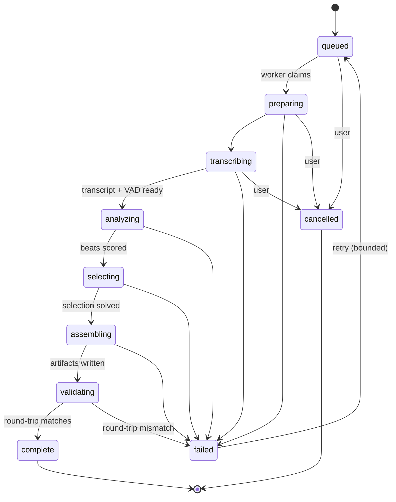
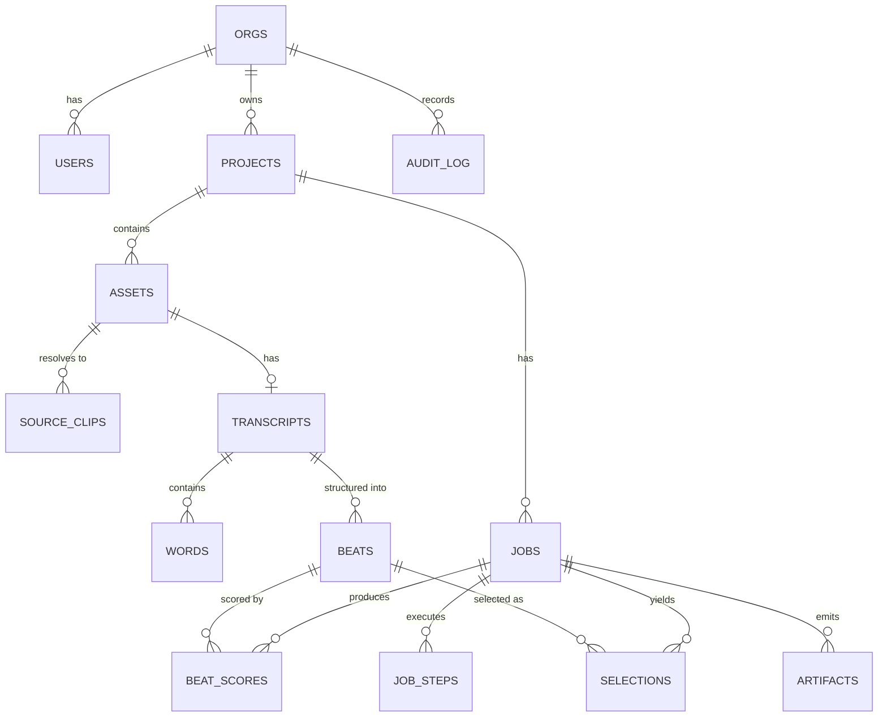

# 03 — Platform & Data

## Orchestration

Jobs are long, multi-step, and failure-prone. A worker dying at step nine of twelve
must resume at step nine, not step one — re-running transcription because artifact
generation crashed is both slow and a direct cash cost.

**AWS Step Functions**, with each step an ECS task. Rationale:

- Durable execution and declarative retry with backoff per step
- Per-execution history, which doubles as an operational audit trail
- Native to AWS, nothing to operate, no control plane to run
- Step-level timeouts and heartbeats without custom code

The design constraint that makes the orchestrator swappable: **every step is a pure,
idempotent function of `(job_id, step_input_ref) → step_output_ref`**, with inputs
and outputs in S3 and status in Postgres. Step Functions passes references, never
payloads — there is a 256 KB state size limit, and a transcript will exceed it.

If workflow logic outgrows what ASL expresses comfortably — dynamic fan-out over
variable source-clip counts, complex conditional branching — migrate to Temporal.
Because steps are already pure and idempotent, that migration rewrites the
orchestration layer only. Do not start on Temporal: it is the right destination and
the wrong starting point for a small team, and paying its operational and learning
cost before there is a product is a poor trade.

### Job state machine



Coarse states are what the user sees. Fine-grained per-step status lives in
`job_steps` and drives the progress UI.

## Compute tiers

| Tier | Runs on | Steps | Why |
|---|---|---|---|
| API | Fargate, small | HTTP only | Stateless, scales on request count |
| Light worker | Fargate | Structure, score, solve, review, assemble, emit, validate | No large disk needed; mostly waiting on vendor APIs |
| Heavy worker | EC2 spot, compute-optimized, EBS | ffmpeg extract, AAF demux, probe | Needs real scratch disk and sustained CPU. Fargate ephemeral storage caps at 200 GB, which large AAFs exceed |

No GPU tier. ASR is a vendor call — see
[ADR-0003](../adr/0003-managed-asr-behind-an-interface.md).

Spot interruption on the heavy tier is handled by the idempotency rule: a step
interrupted mid-run is simply re-run.

## Data model



### Tables

```sql
orgs           (id, name, plan, retention_days, created_at)
users          (id, org_id, email, external_id, role, created_at)
projects       (id, org_id, name, created_by, created_at, archived_at)

assets         (id, org_id, project_id, kind,           -- video | aaf | audio
                s3_bucket, s3_key, bytes, checksum,
                edit_rate_num, edit_rate_den, start_tc_frames,
                drop_frame, duration_frames, probe jsonb,
                ingest_mode, created_at)

source_clips   (id, org_id, asset_id, mob_id, tape_name,
                src_tc_in_frames, src_tc_out_frames,
                track_kind, track_index, file_path)

jobs           (id, org_id, project_id, status,
                notes_raw, brief jsonb,
                model_versions jsonb,                    -- asr, llm, prompt versions
                cost_cents, started_at, finished_at, error jsonb)

job_assets     (job_id, asset_id, order_idx,             -- a job draws on many
                primary key (job_id, asset_id))          -- assets; an asset
                                                         -- feeds many jobs

job_steps      (id, org_id, job_id, name, status, attempt,
                input_ref, output_ref, started_at, finished_at, error jsonb)

transcripts    (id, org_id, asset_id, provider, provider_model,
                language, raw_s3_key, created_at)

words          (id, org_id, transcript_id, source_clip_id, idx,
                text, start_ns bigint, end_ns bigint,
                confidence real, speaker text)

beats          (id, org_id, transcript_id, asset_id, idx, source_clip_id,
                start_ns bigint, end_ns bigint, speaker,
                text, flags text[], embedding vector(1024))

speaker_links  (id, org_id, project_id, canonical_speaker_id,
                asset_id, speaker_id, confirmed_by, confirmed_at)

beat_scores    (id, org_id, job_id, beat_id, scores jsonb,
                depends_on uuid[], rationale text, cluster_id uuid)

selections     (id, org_id, job_id, beat_id, asset_id, order_idx,
                src_tc_in_frames, src_tc_out_frames, reason text)

artifacts      (id, org_id, job_id, kind,                -- aaf | fcpxml | edl | otio | json
                s3_key, bytes, validated bool, validation jsonb, created_at)

audit_log      (id, org_id, actor_user_id, action, resource_type,
                resource_id, ip inet, user_agent, at timestamptz)
```

**Notes on shape:**

`words` — a three-hour transcript is roughly 40k rows. Across many jobs this reaches
millions, which Postgres handles without concern, and it buys full-text search and
precise range queries. The canonical raw ASR response still lives in S3; this table
is the query surface, not the record of truth. Partition by `transcript_id` if it
ever becomes a problem, which it likely will not.

`job_assets` — the join table that makes a project a project. Footage arrives over
weeks and one finished piece is cut from several sessions, so a job draws on many
assets and an asset feeds many jobs. Both halves matter: the many-to-one direction
is what lets an editor cut three pieces from one interview, and the one-to-many
direction is what lets them cut one piece from three days of rushes. `order_idx` is
the upload order, which is all "chronological" can honestly mean for material shot
on different days — beats carry their own asset's local timing and there is
deliberately no global timeline. See `apps/api/src/mishne/pipeline/project.py`.

`transcripts.asset_id` (not `job_id`) — transcription is the expensive step and it
belongs to the *asset*. An upload transcribed today is re-used by a job next month
at no cost, which is the whole economics of separated uploads. `beats.asset_id` is
denormalised from the transcript for the same reason it exists in the pipeline: a
beat's timing is local to its own file and is meaningless without it.

`speaker_links` — the same person recorded on two days is two speakers until a human
says otherwise. Attribution knows which microphone a voice came down and nothing at
all about whether Tuesday's track 1 is Friday's track 1. Guessing reads as
intelligence right up until it puts words in the wrong mouth in a delivered cut,
where nobody can tell it happened. So the merge is a row a person creates, and
`confirmed_by` records who.

`beats.embedding` — pgvector, for redundancy clustering. Avoids introducing a second
datastore for a workload measured in hundreds of vectors per job.

`model_versions` on `jobs` — the reproducibility contract. Without it, "why did the
output change?" is unanswerable.

Every table carries `org_id`, including ones where it is derivable by join. This is
deliberate: it makes RLS policies simple and uniform, and removes any path where a
missing join condition leaks data across tenants.

## API surface

```
POST   /v1/projects
GET    /v1/projects
GET    /v1/projects/{id}

POST   /v1/projects/{id}/assets          -> presigned multipart upload
POST   /v1/assets/{id}/complete
GET    /v1/assets/{id}                   -> probe result, ready state

POST   /v1/jobs                          -> {asset_ids[], notes, target_duration_s}
GET    /v1/jobs/{id}
GET    /v1/jobs/{id}/events              -> SSE progress stream
POST   /v1/jobs/{id}/cancel

GET    /v1/jobs/{id}/artifacts           -> presigned download URLs
GET    /v1/jobs/{id}/transcript          -> transcript + used/unused + rationale
```

Async by default. Job creation returns 202 with an id; progress arrives over SSE.

## Frontend

Next.js App Router. Notable concerns:

**Upload** — Uppy with the S3 multipart plugin. Resumable across page reloads and
network drops. For a multi-gigabyte file on a hotel connection this is the
difference between a working product and a broken one. Show real throughput and time
remaining; a four-hour upload with an honest estimate is tolerable, a four-hour
upload with a spinner is not.

**Transcript page** — a three-hour transcript is ~40k words. Virtualize
(`@tanstack/react-virtual`); do not render it all. Used and unused material is
visually distinguished, each selected segment exposes its rationale on demand, and
timecodes are click-to-copy. This page is the trust-building surface of the product
and deserves disproportionate design attention.

**Job progress** — SSE from the API. Show which stage is running and a genuine
estimate. A 45-minute job with no visible progress will be assumed broken and
resubmitted, which doubles cost.

**Brief input** — guided form plus free-text notes, not free text alone. Surface the
compiled brief's `clarifications` before the job starts, so assumptions are corrected
up front rather than discovered in the output.

## Observability

- Structured JSON logs, correlation ID per job, propagated to every step.
- **No transcript text, filenames, or customer content in logs, ever.** IDs,
  durations, counts, and status only. This is a security requirement, not a
  preference — see [04 — Security](04-security.md).
- OpenTelemetry traces spanning API → orchestrator → steps → vendor calls.
- Per-job cost accounting written to `jobs.cost_cents`: ASR seconds, LLM tokens in
  and out per stage, compute seconds. Without this, unit economics are guesswork and
  a prompt change that triples cost goes unnoticed.
- Alarms on: job failure rate, p95 job duration, validation-gate failures, vendor
  error rate, spot interruption rate, and cost per job exceeding a threshold.

The validation-gate failure rate is the single most valuable metric in the system —
it is a direct measure of interchange correctness, which is the biggest technical
risk.

## Environments

Three: `dev`, `staging`, `prod`. Separate AWS accounts, separate KMS keys, no shared
data. Infrastructure as code from the first commit — Terraform or CDK, either is
fine; consistency matters more than the choice.

Staging holds synthetic media only. Never copy customer footage into a lower
environment, regardless of how much easier it makes reproducing a bug.
