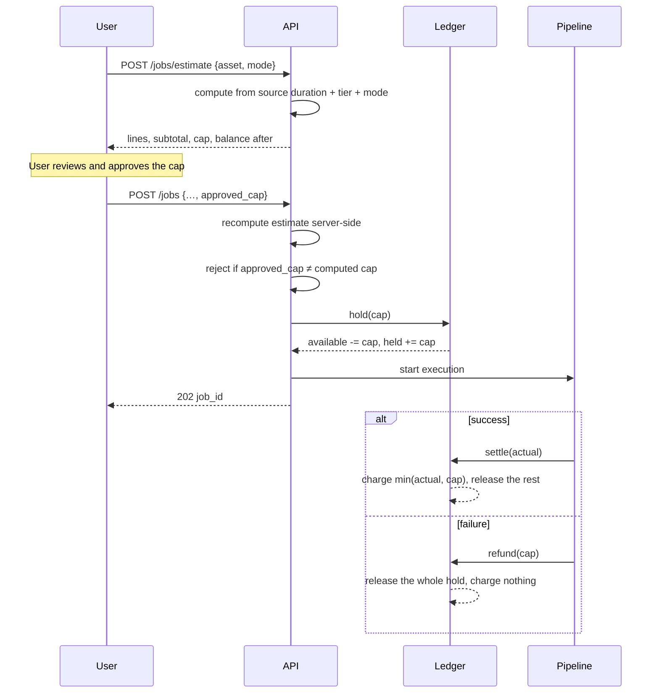

# 06 — Billing & Metering

## Shape of the model

Two orthogonal things:

- **Tier** — a subscription that sets the *rate* and the *limits*: credits per
  source hour, maximum source length per job, concurrent jobs, retention, SSO.
- **Credits** — prepaid consumption, bought in packs. Credits pay for jobs.

Keeping them separate means a customer can sit on a plan that matches their
requirements without being forced into a usage commitment, and can buy capacity
when a project demands it.

**1 credit = US$1.** Deliberately transparent. An opaque credit unit invites the
suspicion that the exchange rate moves when nobody is looking, and that suspicion
is expensive with professional buyers.

| Tier | Price | Credits / source hour | Max source | Concurrent | Retention |
|---|---|---|---|---|---|
| Starter | Free | 12 | 2 h | 1 | 7 days |
| Pro | $49/mo | 9 | 6 h | 3 | 30 days |
| Studio | Custom | 7 | 12 h | 10 | 90 days |

Credit packs: $50 → 50 credits, $100 → 105, $200 → 220. The bonus on larger
packs is a volume incentive, not a discount on the rate.

## What drives cost

**Source duration, not target length.** Transcription is billed per minute of
audio, and the engine's token count is a function of transcript length. Reading
three hours is the work; writing ten minutes is not. A user asking for a 4-minute
cut and a user asking for a 20-minute cut from the same rushes cost the same to
serve, and should be charged the same.

This is worth stating in the UI, because the intuition runs the other way.

Estimate lines, per job:

| Line | Basis |
|---|---|
| Transcription and alignment | 3.5 credits/source hour, all tiers |
| Edit engine | Tier rate less 3.5, per source hour. **Skipped in manual mode** |
| Assembly and artifacts | 1 credit flat |
| Additional audio tracks | 0.5 credits/source hour per track beyond two |

Minimum charge 2 credits. The estimate is rounded up to whole credits.

Against a variable cost of roughly $1–5 per three-hour job (see
[05 — Roadmap & Risks](05-roadmap-and-risks.md)), a 3-hour Pro job at 28 credits
leaves a comfortable margin. The risk is drift, not level — hence per-job cost
telemetry.

## Estimate, approve, hold, settle



Four decisions in that flow, each load-bearing.

**The user approves before submission.** No job starts without an explicit
approval of a specific figure. Consumption pricing without a pre-commitment step
produces bill shock, and bill shock produces churn and chargebacks.

**The approved figure is a cap, not a quote.** Settlement charges
`min(actual, approved)`. The user is never billed more than they agreed to; if
the job comes in cheaper, they keep the difference. This removes the main
objection to consumption pricing at almost no cost, because estimates are
conservative by construction.

**Credits are held at submission, not debited at completion.** Otherwise a user
with 5 credits starts ten concurrent jobs. The hold reserves against the balance
immediately and is released on settle, refund or cancel.

**The API recomputes the estimate.** `approved_cap` arriving from a client is a
claim, not a price. It is checked against a freshly computed estimate and the job
is rejected on mismatch.

**A failed job is never charged.** Full refund, automatically, including when the
round-trip validation gate rejects the artifacts. Charging for a broken AAF is
the fastest way to lose a professional customer.

## The ledger

Append-only. **Balance is a projection of the ledger, never a mutable column** —
a mutable balance is how double-charges and silent drift happen, and it is
unauditable after the fact.

```
purchase   +credits   Stripe payment settled
grant      +credits   promotional or support credit
hold       −credits   job submitted, cap reserved
release    +credits   job cancelled, hold returned
settle     −credits   job succeeded, actual charged
refund     +credits   job failed, hold returned in full
adjustment ±credits   manual correction, always with a reason
```

Every entry carries `org_id`, and `project_id` where applicable. **Per-project
usage falls out of filtering the ledger by `project_id`** — no separate counter
to keep in step, which means it cannot drift from the truth.

See [ADR-0006](../adr/0006-credit-hold-settle-ledger.md).

## Idempotency

Both places where money moves are retry-prone, and both need explicit protection:

- **Stripe webhooks** are delivered at least once. Dedupe on Stripe event id,
  with a unique constraint. Credits are granted on the webhook, never on the
  checkout redirect — the user closing the tab must not lose their purchase.
- **Pipeline settlement** can be retried by the orchestrator. Unique constraint
  on `(job_id, kind)` so a second `settle` for the same job is a no-op rather
  than a double charge.

Ledger writes run in a serializable transaction against the org's balance
projection.

## Limits and enforcement

Checked at estimate time so the user finds out before writing a brief:

- source duration against `tier.max_source_hours`
- running job count against `tier.concurrent_jobs`
- available balance against the cap, with the smallest sufficient pack offered
  inline when it falls short

## Open questions

Deliberately unresolved, flagged rather than guessed:

- **Do credits expire?** Currently no. Non-expiring credits are a deferred
  revenue liability; expiry is customer-hostile. Revisit with an accountant.
- **Rollover and overage on subscription tiers** — should a plan include a
  monthly credit allowance? Simpler not to, initially.
- **Refund policy for a technically successful but unusable cut.** The validation
  gate catches broken artifacts, not disappointing selections. Some discretionary
  credit budget will be needed; better to decide the rule than to improvise.
