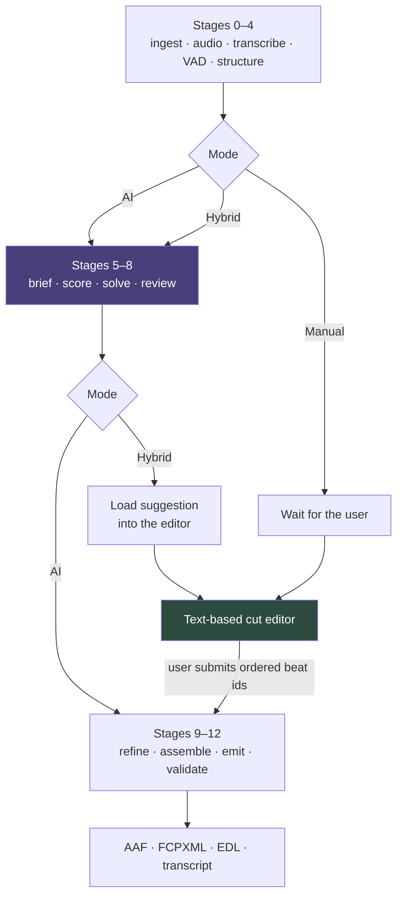

# 07 — Job Modes & Text-Based Editing

## Three ways to make a cut

| Mode | What the user does | What runs | Charged for |
|---|---|---|---|
| **AI** | Writes director's notes, submits | All 12 stages | Transcription + engine + artifacts |
| **Hybrid** | Submits notes, then edits the proposed cut | All 12 stages, paused after 8 | Transcription + engine + artifacts |
| **Manual** | Marks the cut on the transcript themselves | Stages 0–4, then 9–12 | Transcription + artifacts |

Every mode produces the same artifacts. Only the way the selection gets made
differs.

## Why this is nearly free to support

Stage 7 produces one thing: **an ordered list of beats**. Everything downstream —
cut-point refinement, timeline assembly, artifact generation, validation — takes
that list and does not care where it came from.

The user-authored cut enters through `POST /jobs/{id}/cut` with an ordered list
of beat ids, in exactly the shape the solver would have emitted. This is a direct
payoff of the staged design in
[01 — Edit Engine](01-edit-engine.md): because selection is a discrete stage with
a narrow output contract, a human can stand in for it.

**Cut-point refinement still runs.** The user picks *what*; stage 9 still decides
*where* — snapping outward to silence, adding handles, refusing to cut inside a
word, quantizing to frame boundaries. A human marking text should not have to
think about frame accuracy, and should not be allowed to produce a cut that
clips a consonant.

## Why each mode earns its place

**Manual** is the honest answer to a real objection. Plenty of editors do not
want a machine choosing their soundbites, but every one of them wants a
frame-accurate transcript they can cut on instead of scrubbing three hours of
rushes. Manual mode sells the transcription and assembly value without asking
them to trust the selection — and it costs less, which makes the offer credible.

**Hybrid** is where most professional use will land. The engine's proposal is a
starting point rather than a verdict, and the editor keeps authorship. It also
produces the most valuable data in the product: **the diff between what the
engine proposed and what the editor shipped** is a direct, continuous quality
signal — the same metric as Spike B in
[05 — Roadmap & Risks](05-roadmap-and-risks.md), collected for free on every job.
Instrument it from the first hybrid job.

**AI** is the fastest path and the one that demos well.

## The editor

Two panes. Left, the full transcript with every beat. Right, the cut in order.

- Clicking a beat adds it to the cut; clicking again removes it.
- **The cut is ordered independently of source order.** A rough cut is rarely
  chronological, and reordering is most of the editorial work.
- Running duration against target is always visible, and it is the number the
  user is actually steering by.
- Flagged material — filler, false starts, off-mic, crosstalk — is hidden by
  default and one click away. Hiding beats a machine would never choose, while
  keeping them retrievable, is the difference between a usable transcript and a
  wall of text.
- In hybrid mode the engine's selection is the initial state, each suggested beat
  is marked, and "reset to suggestion" is always available. Every edit is a diff
  against a known baseline.

At three hours the beat list runs to several hundred entries, so the transcript
pane virtualizes.

## What this changes elsewhere

**Job status** gains `awaiting_edit` — the transcript is ready and the pipeline
is parked waiting on a person. Unlike every other non-terminal state, it has no
timeout and consumes no compute.

**Credit holds outlive the pipeline run.** A hybrid job may sit in
`awaiting_edit` for days with credits held. Two consequences worth deciding
before launch: hold expiry (release after N days, requiring re-approval), and
whether stage 5–8 costs settle when the engine finishes rather than waiting for
the user's submission. Settling the engine portion early is more honest — that
work is done and cannot be un-done — but it complicates the single-settlement
model. Currently unresolved.

**Retention interacts.** A job parked in `awaiting_edit` must not have its source
media purged out from under it. Retention counts from job completion, not from
upload, and a parked job is not complete.

## Not in scope yet

- Word-level trimming inside a beat. Beats are the unit; sub-beat trimming is
  what the NLE is for.
- Editing the transcript text itself to fix ASR errors. Worth doing, but it
  raises the question of what the timeline references when the text no longer
  matches the audio.
- Multiple users editing one cut at once.
